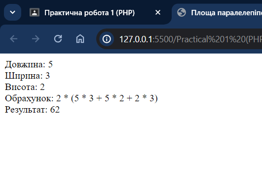

# Практична робота 1 (PHP)

## Завдання

Написати програму обчислення площі поверхні паралелепіпеда.

## Код програми

```php
<!DOCTYPE html>
<html lang="en">
<head>
    <meta charset="UTF-8">
    <meta name="viewport" content="width=device-width, initial-scale=1.0">
    <title>Площа паралелепіпеда</title>
</head>
<body>
    <?php

    function parallelepipedArea($length, $width, $height) {
        $parallelepipedArea = 2 * ($length * $width + $length * $height + $height * $width);
        return $parallelepipedArea;
    }

    $length = 5;
    $width = 3;
    $height = 2;

    $result = parallelepipedArea($length, $width, $height);

    echo "Довжина: $length". "<br>";
    echo "Ширина: $width". "<br>";
    echo "Висота: $height". "<br>";
    echo "Обрахунок: 2 * ($length * $width + $length * $height + $height * $width)". "<br>";
    echo "Результат: $result";

    ?>
</body>
</html>
```

## Результат


