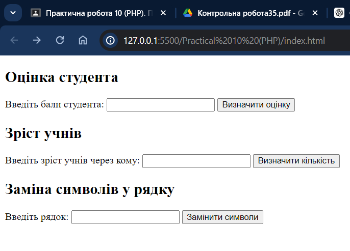
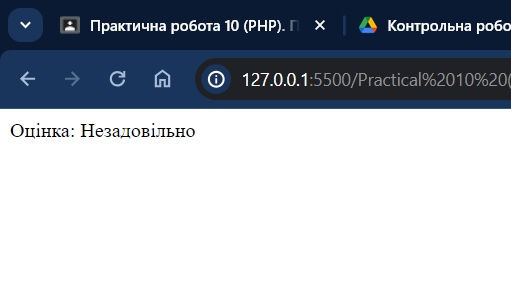
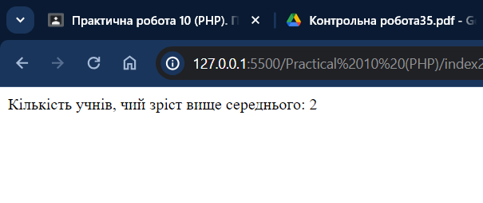
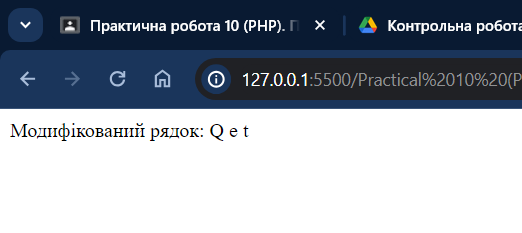

# Практична робота 10 (PHP)

## Виконавець

Любченко Олег

Варіант: 14

Група: 35

## Умова задачі

### Завдання

- За введеними балами визначити оцінку студента (0..59 – незадовільно, 60..74 – задовільно, 75..89 – добре, 90..100 - відміно). При помилковому введенні числа вивести повідомлення про помилку.
- Відомо зріст учнів класу. Визначити кількість учнів, чий зріст вище середнього у класі (масив).
- У заданому рядку замінити кожен другий символ рядку на пробіл.

### Розв'язання

```html
<!DOCTYPE html>
<html lang="uk">
<head>
    <meta charset="UTF-8">
    <title>Завдання</title>
</head>
<body>

    <form method="post" action="index.php">
        <h2>Оцінка студента</h2>
        <label for="score">Введіть бали студента:</label>
        <input type="number" id="score" name="score" required>
        <button type="submit">Визначити оцінку</button>
    </form>

    <form method="post" action="index2.php">
        <h2>Зріст учнів</h2>
        <label for="heights">Введіть зріст учнів через кому:</label>
        <input type="text" id="heights" name="heights" required>
        <button type="submit">Визначити кількість</button>
    </form>

    <form method="post" action="index3.php">
        <h2>Заміна символів у рядку</h2>
        <label for="string">Введіть рядок:</label>
        <input type="text" id="string" name="string" required>
        <button type="submit">Замінити символи</button>
    </form>

</body>
</html>
```

```php
<?php
// Перевірка, чи встановлено метод запиту та чи є він POST
if (isset($_SERVER["REQUEST_METHOD"]) && $_SERVER["REQUEST_METHOD"] == "POST") {
    // Перевірка, чи передано значення score через POST
    if (isset($_POST["score"])) {
        $score = $_POST["score"];
        
        // Перевірка, чи є score числом у межах від 0 до 100
        if (!is_numeric($score) || $score < 0 || $score > 100) {
            echo "Помилка: введіть число від 0 до 100.";
        } else {
            // Визначення оцінки на основі введених балів
            if ($score <= 59) {
                echo "Оцінка: Незадовільно";
            } elseif ($score <= 74) {
                echo "Оцінка: Задовільно";
            } elseif ($score <= 89) {
                echo "Оцінка: Добре";
            } else {
                echo "Оцінка: Відміно";
            }
        }
    } else {
        echo "Помилка: бали не були передані.";
    }
} else {
    echo "Помилка: неправильний метод запиту.";
}
?>
```

```php
<?php
// Перевірка, чи встановлено метод запиту та чи є він POST
if (isset($_SERVER["REQUEST_METHOD"]) && $_SERVER["REQUEST_METHOD"] == "POST") {
    // Перевірка, чи передано значення heights через POST
    if (isset($_POST["heights"])) {
        $heights_input = $_POST["heights"];
        // Перетворення введених даних на масив чисел
        $heights = array_map('floatval', explode(',', $heights_input));
        
        // Перевірка, чи масив heights не порожній
        if (count($heights) == 0) {
            echo "Помилка: введіть коректні дані.";
        } else {
            // Обчислення середнього зросту
            $average_height = array_sum($heights) / count($heights);
            // Підрахунок кількості учнів, чий зріст вище середнього
            $count_above_average = count(array_filter($heights, function($height) use ($average_height) {
                return $height > $average_height;
            }));
            
            echo "Кількість учнів, чий зріст вище середнього: $count_above_average";
        }
    } else {
        echo "Помилка: дані не були передані.";
    }
} else {
    echo "Помилка: неправильний метод запиту.";
}
?>
```

```php
<?php
// Перевірка, чи встановлено метод запиту та чи є він POST
if (isset($_SERVER["REQUEST_METHOD"]) && $_SERVER["REQUEST_METHOD"] == "POST") {
    // Перевірка, чи передано значення string через POST
    if (isset($_POST["string"])) {
        $string = $_POST["string"];
        
        $modified_string = '';
        // Замінюємо кожен другий символ на пробіл
        for ($i = 0; $i < strlen($string); $i++) {
            if ($i % 2 == 1) {
                $modified_string .= ' ';
            } else {
                $modified_string .= $string[$i];
            }
        }
        
        echo "Модифікований рядок: $modified_string";
    } else {
        echo "Помилка: рядок не був переданий.";
    }
} else {
    echo "Помилка: неправильний метод запиту.";
}
?>
```





