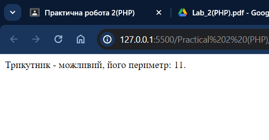
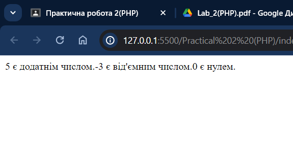
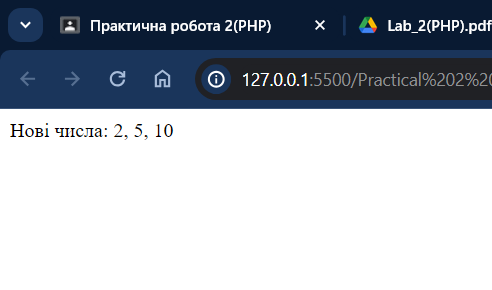
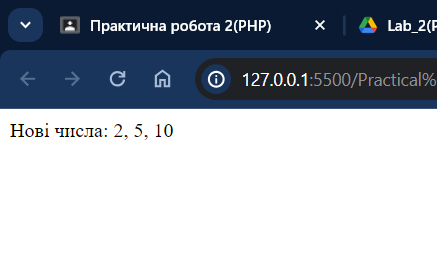
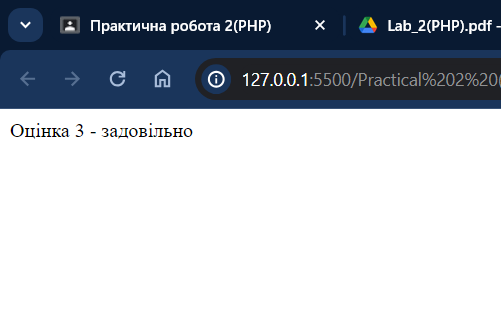

# Практична робота 2 (РНР)

## Виконавець

Любченко Олег

## Умова задачі

### Завдання 1

- Маємо дійсні додатні числа x, y, z. Складіть програму, яка буде перевіряти існування трикутника з довжинами сторін x, y, z. Визначити периметр трикутника.
- Перевірити чи є введене з клавіатури число додатнім, від'ємним, нулем.
- Дано три різних дійсних числа a, b, c. Замінити найменше число добутком
  двох більших.

### Завдання 2

- Написати програму, яка за введеним символом математичної операції здійснює
  відповідну дію над двома числами. При помилковому введенні числа
  виводиться повідомлення про помилку (приклад 3).
- Написати програму переведення оцінки з числового формату в текстовий.(
  Наприклад 2 – "незадовільно").

## Розв'язання

### Завдання 1

```php
    <?php

        function TriangleCheck($x, $y, $z) {
            if ($x + $y > $z && $x + $z > $y && $y + $z > $x) {
                return true;
            } else {
                return false;
            }
        }

        function Long($x, $y, $z) {
            return $x + $y + $z;
        }

        $x = 5;
        $y = 3;
        $z = 3;

        $result = TriangleCheck($x, $y, $z);

        if ($result) {
            $long = Long($x, $y, $z);
            echo "Трикутник - можливий, його периметр: $long.<br>";
        } else {
            echo "Трикутник - неможливий!<br>";
        }

    ?>
```



```php
    <?php

        function checkNumber($number) {
            if ($number > 0) {
                echo "$number є додатнім числом.";
            } elseif ($number < 0) {
                echo "$number є від'ємним числом.";
            } else {
                echo "$number є нулем.";
            }
        }

        checkNumber(5);
        checkNumber(-3);
        checkNumber(0);

    ?>
```



```php
    <?php

        function replaceSmallest($a, $b, $c) {

            $min = min($a, $b, $c);


            $max1 = ($a !== $min) ? $a : (($b !== $min) ? $b : $c);
            $max2 = ($a !== $min && $a !== $max1) ? $a : (($b !== $min && $b !== $max1) ? $b : $c);

            $replacement = $max1 * $max2;
          
            if ($a === $min) {
                $a = $replacement;
            } elseif ($b === $min) {
                $b = $replacement;
            } else {
                $c = $replacement;
            }

            return [$a, $b, $c];
        }

        $a = 2;
        $b = 5;
        $c = 1;
        $newNumbers = replaceSmallest($a, $b, $c);
        echo "Нові числа: " . implode(', ', $newNumbers);

    ?>
```



### Завдання 2

```php
    <?php

        function calculate($operator, $operand1, $operand2) {
            switch ($operator) {
                case '+':
                    return $operand1 + $operand2;
                case '-':
                    return $operand1 - $operand2;
                case '*':
                    return $operand1 * $operand2;
                case '/':
                    if ($operand2 != 0) {
                        return $operand1 / $operand2;
                    } else {
                        return "Помилка: Ділення на нуль!";
                    }
                default:
                    return "Помилка: Непідтримувана операція!";
            }
        }


        $operator = '+';
        $operand1 = 10;
        $operand2 = 5;
        $result = calculate($operator, $operand1, $operand2);
        echo "Результат: $result";

    ?>
```



```php
    <?php

        function numericToTextGrade($grade) {
            switch ($grade) {
                case 1:
                    return "незадовільно";
                case 2:
                    return "достатньо";
                case 3:
                    return "задовільно";
                case 4:
                    return "добре";
                case 5:
                    return "відмінно";
                default:
                    return "невідома оцінка";
            }
        }

        $grade = 3;
        $textGrade = numericToTextGrade($grade);
        echo "Оцінка $grade - $textGrade";

    ?>
```


