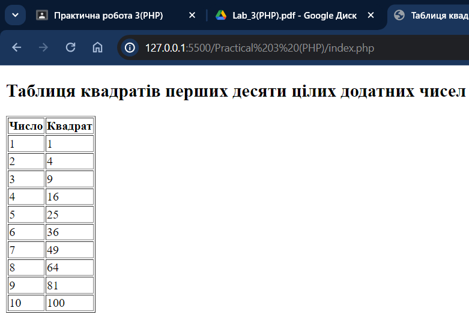
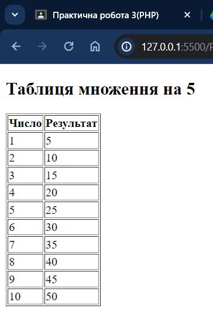
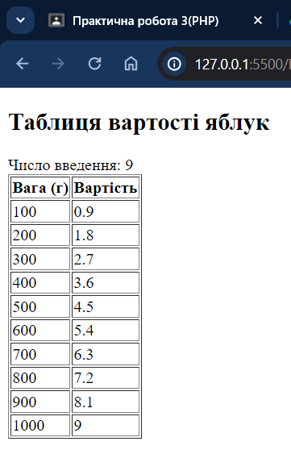
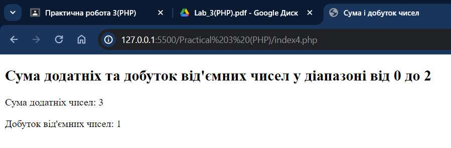

# Практична робота 3 (PHP)

## Виконавець

Любченко Олег

## Умова задачі

### Завдання 1

- Написати програму, яка виводить таблицю квадратів перших десяти цілих
  додатних чисел.
- Написати програму, яка виводить таблицю множення на довільне число.

### Завдання 2

- Написати програму, яка виводить на екран таблицю вартості яблук в
  діапазоні від 100 г до 1 кг. з кроком 100г.(вартість вводиться під час роботи
  програми).
- Написати програму визначення суми доданих та добутку від'ємних цілих
  чисел в діапазоні від А до В.

## Розв'язання

### Завдання 1

```php
<!DOCTYPE html>
<html lang="uk">
<head>
    <meta charset="UTF-8">
    <meta name="viewport" content="width=device-width, initial-scale=1.0">
    <title>Таблиця квадратів</title>
</head>
<body>
    <h2>Таблиця квадратів перших десяти цілих додатних чисел</h2>
    <table border="1">
        <tr>
            <th>Число</th>
            <th>Квадрат</th>
        </tr>
        <?php
        for ($i = 1; $i <= 10; $i++) {
            $square = $i * $i;
            echo "<tr><td>$i</td><td>$square</td></tr>";
        }
        ?>
    </table>
</body>
</html>

```



```php
<!DOCTYPE html>
<html lang="uk">
<head>
    <meta charset="UTF-8">
    <meta name="viewport" content="width=device-width, initial-scale=1.0">
    <title>Таблиця множення</title>
</head>
<body>
    <?php
    $number = rand(1, 10);
    echo "<h2>Таблиця множення на $number</h2>";
    echo "<table border='1'>";
    echo "<tr><th>Число</th><th>Результат</th></tr>";
    for ($i = 1; $i <= 10; $i++) {
        $result = $number * $i;
        echo "<tr><td>$i</td><td>$result</td></tr>";
    }
    echo "</table>";
    ?>
</body>
</html>

```



### Завдання 2

```php
<!DOCTYPE html>
<html lang="uk">
<head>
    <meta charset="UTF-8">
    <meta name="viewport" content="width=device-width, initial-scale=1.0">
    <title>Таблиця вартості яблук</title>
</head>
<body>
    <?php
    $price_per_kg = rand(1, 10);
    $step = 100;
    echo "<h2>Таблиця вартості яблук</h2>";
    echo "Число введення: $price_per_kg";
    echo "<table border='1'>";
    echo "<tr><th>Вага (г)</th><th>Вартість</th></tr>";
    for ($weight = 100; $weight <= 1000; $weight += $step) {
        $price = $price_per_kg * ($weight / 1000);
        echo "<tr><td>$weight</td><td>$price</td></tr>";
    }
    echo "</table>";
    ?>
</body>
</html>
```



```php
<!DOCTYPE html>
<html lang="uk">
<head>
    <meta charset="UTF-8">
    <meta name="viewport" content="width=device-width, initial-scale=1.0">
    <title>Сума і добуток чисел</title>
</head>
<body>
    <?php
    $A = rand(-10, 0);
    $B = rand(0, 10);
    $sum_positive = 0;
    $product_negative = 1;
    for ($i = $A; $i <= $B; $i++) {
        if ($i > 0) {
            $sum_positive += $i;
        } elseif ($i < 0) {
            $product_negative *= $i;
        }
    }
    echo "<h2>Сума додатніх та добуток від'ємних чисел у діапазоні від $A до $B</h2>";
    echo "<p>Сума додатніх чисел: $sum_positive</p>";
    echo "<p>Добуток від'ємних чисел: $product_negative</p>";
    ?>
</body>
</html>

```


