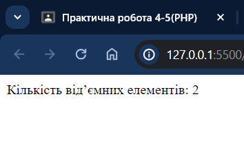
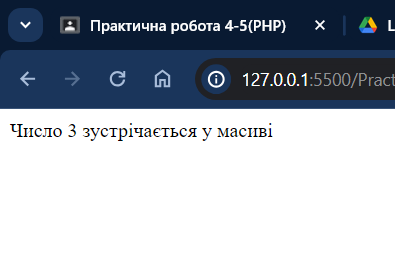
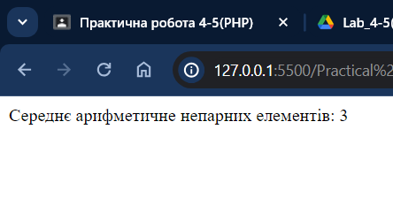
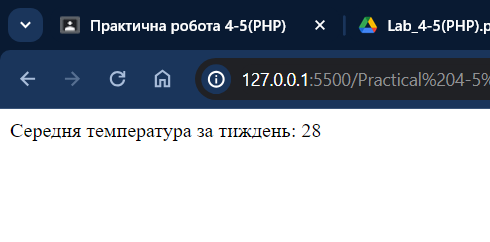
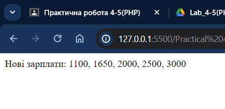
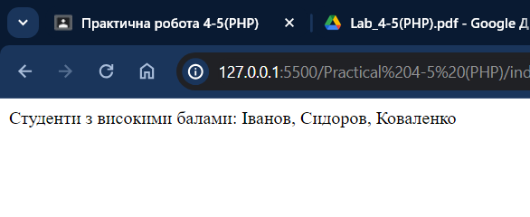
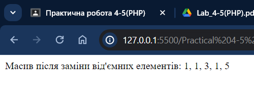
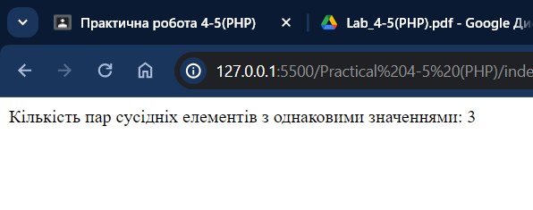
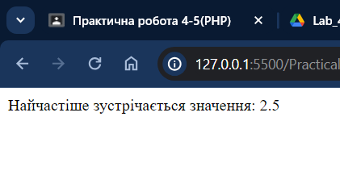

# Практична робота 4-5 (PHP)

## Виконавець

Любченко Олег

## Умова задачі

### Завдання 1

- Написати програму, яка підраховує кількість від'ємних елементів масиву
- Написати програму, яка визначає, чи зустрічається у масиві введене з клавіатури число.

### Завдання 2

- Написати програму, яка визначає середнє арифметичне непарних елементів
  масиву
- Написати програму, яка визначає середню температуру повітря за тиждень.

### Завдання 3

- Складіть програму. Відомо зарплати працівників підприємства. Збільшити
  зарплату працівникам на 10%, якщо вона менша середньої зарплати по
  підприємству (середню зарплату визначити у програмі)
- Складіть програму. Відомо середній бал студентів першого курсу. Вивести
  прізвища студентів, які навчаються на «4» та «5».

### Додаткові завдання

- Замінити всі від'ємні елементи одновимірного масиву цілих чисел на значення
  найменшого з додатних чисел (нуль не враховувати).
- Підрахувати кількість пар сусідніх елементів одновимірного масиву цілих
  чисел з однаковими значеннями.
- Визначити, яке значення зустрічається у масиві дійсних чисел найчастіше.

## Розв'язання

### Завдання 1

```php
<?php
function countNegativeElements($array) {
    $count = 0;
    foreach ($array as $element) {
        if ($element < 0) {
            $count++;
        }
    }
    return $count;
}

$array = [1, -2, 3, -4, 5];
echo "Кількість від’ємних елементів: " . countNegativeElements($array);
?>

```



```php
<?php
function findNumber($array, $number) {
    return in_array($number, $array);
}

$array = [1, 2, 3, 4, 5];
$number = 3;
if (findNumber($array, $number)) {
    echo "Число $number зустрічається у масиві";
} else {
    echo "Число $number не зустрічається у масиві";
}
?>

```



### Завдання 2

```php
<?php
function calculateAverageOdd($array) {
    $sum = 0;
    $count = 0;
    foreach ($array as $element) {
        if ($element % 2 != 0) {
            $sum += $element;
            $count++;
        }
    }
    return $sum / $count;
}

$array = [1, 2, 3, 4, 5];
echo "Середнє арифметичне непарних елементів: " . calculateAverageOdd($array);
?>

```



```php
<?php
function calculateWeeklyTemperatureAverage($temperatures) {
    $sum = array_sum($temperatures);
    $count = count($temperatures);
    return $sum / $count;
}

$temperatures = [25, 26, 27, 28, 29, 30, 31];
echo "Середня температура за тиждень: " . calculateWeeklyTemperatureAverage($temperatures);
?>

```



### Завдання 3

```php
<?php
function increaseSalaries(&$salaries) {
    $averageSalary = array_sum($salaries) / count($salaries);
    foreach ($salaries as &$salary) {
        if ($salary < $averageSalary) {
            $salary *= 1.1;
        }
    }
}

$salaries = [1000, 1500, 2000, 2500, 3000];
increaseSalaries($salaries);
echo "Нові зарплати: " . implode(", ", $salaries);
?>

```



```php
<?php
function getExcellentStudents($students, $threshold) {
    $excellentStudents = [];
    foreach ($students as $surname => $averageGrade) {
        if ($averageGrade >= $threshold) {
            $excellentStudents[] = $surname;
        }
    }
    return $excellentStudents;
}

$students = [
    'Іванов' => 4.5,
    'Петров' => 3.8,
    'Сидоров' => 4.2,
    'Коваленко' => 5.0,
];

$excellentStudents = getExcellentStudents($students, 4);
echo "Студенти з високими балами: " . implode(", ", $excellentStudents);
?>

```



### Додаткові завдання

```php
<?php
function replaceNegativeElements(&$array) {
    $minPositive = PHP_INT_MAX;
    foreach ($array as $element) {
        if ($element > 0 && $element < $minPositive) {
            $minPositive = $element;
        }
    }

    foreach ($array as &$element) {
        if ($element < 0) {
            $element = $minPositive;
        }
    }
}

$array = [1, -2, 3, -4, 5];
replaceNegativeElements($array);
echo "Масив після заміни від'ємних елементів: " . implode(", ", $array);
?>

```



```php
<?php
function countAdjacentPairs($array) {
    $count = 0;
    $length = count($array);
    for ($i = 0; $i < $length - 1; $i++) {
        if ($array[$i] == $array[$i + 1]) {
            $count++;
        }
    }
    return $count;
}

$array = [1, 2, 2, 3, 4, 4, 4, 5];
echo "Кількість пар сусідніх елементів з однаковими значеннями: " . countAdjacentPairs($array);
?>

```



```php
<?php
function mostFrequentValue($array) {
    $validValues = array_map('strval', $array);
    $frequency = array_count_values($validValues);
    arsort($frequency);
    $mostFrequent = key($frequency);
    return $mostFrequent;
}

$array = [1.2, 2.5, 3.8, 1.2, 2.5, 2.5, 3.8, 4.3, 4.3];
echo "Найчастіше зустрічається значення: " . mostFrequentValue($array);
?>

```


