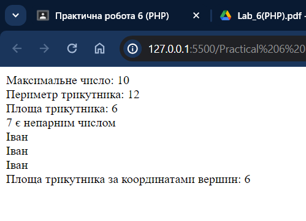

# Практична робота 6 (PHP)

## Виконавець

Любченко Олег

## Умова задачі

### Завдання

- Розробити функцію, яка визначає максимальне з трьох чисел.
- Розробити функцію, яка визначає периметр трикутника.
- Розробити функцію визначення площі трикутника по трьом сторонам.
- Скласти функцію, яка перевірятиме введене з клавіатури число на парність.
- Розробити функцію виведення імені у стовпчик декілька раз.
- Розробити функцію визначення площі трикутника по координатам вершин.

### Розв'язання

```php
<?php

function max_of_three($a, $b, $c) {
    return max($a, $b, $c);
}

echo "Максимальне число: " . max_of_three(5, 10, 3) . "<br>";


function triangle_perimeter($a, $b, $c) {
    return $a + $b + $c;
}

echo "Периметр трикутника: " . triangle_perimeter(3, 4, 5) . "<br>";


function triangle_area($a, $b, $c) {
    $s = triangle_perimeter($a, $b, $c) / 2;
    return sqrt($s * ($s - $a) * ($s - $b) * ($s - $c));
}

echo "Площа трикутника: " . triangle_area(3, 4, 5) . "<br>";


function check_even($num) {
    return ($num % 2 == 0) ? "$num є парним числом" : "$num є непарним числом";
}

echo check_even(7) . "<br>";


function print_name($name, $times) {
    for ($i = 0; $i < $times; $i++) {
        echo $name . "<br>";
    }
}

print_name("Іван", 3);


function triangle_area_by_coords($x1, $y1, $x2, $y2, $x3, $y3) {
    return abs(($x1*($y2-$y3) + $x2*($y3-$y1) + $x3*($y1-$y2))/2);
}

echo "Площа трикутника за координатами вершин: " . triangle_area_by_coords(0, 0, 3, 0, 0, 4) . "<br>";

?>
```


