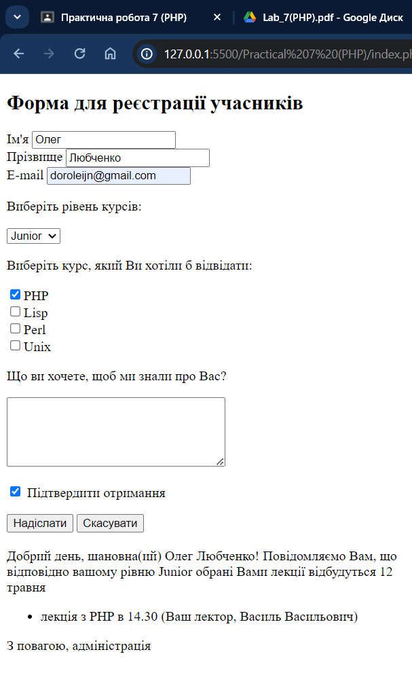

# Практична робота 7 (PHP)

## Виконавець

Любченко Олег

## Умова задачі

### Завдання

- Ознайомитися з теоретичними відомостями та реалізувати приклад.
- Змінити назви курсів, дату, час, імена викладачів та зміст повідомленнь.
Додати власне поле.

### Розв'язання

```php
<!DOCTYPE html>
<html lang="en">
<head>
    <meta charset="UTF-8">
    <meta name="viewport" content="width=device-width, initial-scale=1.0">
    <title>Document</title>
</head>
<body>
    <h2>Форма для реєстрації учасників</h2>
    <form action="index.php" method="POST">
        Ім'я <input type="text" name="first_name" value="Введіть ваше ім'я"><br>
        Прізвище <input type="text" name="last_name"><br>
        E-mail <input type="text" name="email"><br>
      
        <p>Виберіть рівень курсів:</p>
        <select name="level">
            <option value="Junior">Junior</option>
            <option value="Middle">Middle</option>
            <option value="Senior">Senior</option>
        </select><br>
      
        <p>Виберіть курс, який Ви хотіли б відвідати:</p>
        <input type="checkbox" name="kurs[]" value="PHP">PHP<br>
        <input type="checkbox" name="kurs[]" value="Lisp">Lisp<br>
        <input type="checkbox" name="kurs[]" value="Perl">Perl<br>
        <input type="checkbox" name="kurs[]" value="Unix">Unix<br>
      
        <p>Що ви хочете, щоб ми знали про Вас?</p>
        <textarea name="comment" cols=32 rows=5></textarea>
      
        <p><input name="confirm" type="checkbox" checked> Підтвердити отримання</p>
      
        <input type="submit" value="Надіслати">
        <input type="reset" value="Скасувати">
    </form>
</body>
</html>

<?php
if (isset($_POST["first_name"])) {
    $times = array("PHP"=>"14.30", "Lisp"=>"12.00", "Perl"=>"15.00", "Unix"=>"14.00");
    $selectors = array("PHP"=>"Василь Васильович", "Lisp"=>"Іван Іванович", "Perl"=>"Петро Петрович", "Unix"=>"Семен Семенович");
    define("SIGN", "З повагою, адміністрація");
    define("MEETING_TIME", "18.00");
    $date = "12 травня";
    $str = "Добрий день, шановна(ий)  ".$_POST["first_name"]." ".$_POST["last_name"]."!<br>";
    $str .= "Повідомляємо Вам, що відповідно вашому рівню ";
    $level = isset($_POST["level"]) ? $_POST["level"] : '';
    if (!empty($_POST["kurs"])) {
        $kurses = $_POST["kurs"];
        $event = " обрані Вами лекції відбудуться $date <ul>";
        $lect = "";
        foreach ($kurses as $k) {
            $lect .= "<li>лекція з $k в $times[$k]";
            $lect .= "(Ваш лектор, $selectors[$k])";
        }
        $event = $event . $lect . "</ul>";
        $str .= "$event";
    } else {
        $event = " наступні збори студентів";
        $str .= "$event відбудуться $date ". MEETING_TIME . "<br>";   
    }
    $str .= "<br>". SIGN; 
    echo $str;
}
?>


```


