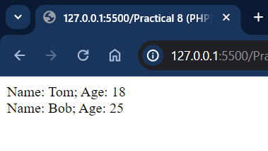

# Практична робота 8 (PHP)

## Виконавець

Любченко Олег

## Умова задачі

### Завдання

- Реалізувати приклади з презентації.
- Напишіть простий клас PHP, який відображає наступний рядок: "Клас MyClass ініціалізовано!"
- Напишіть клас PHP, який визначає периметр трикутника по трьом сторонам та виводить результат на екран
- Напишіть простий клас PHP, який відображає рядок введений у поле форми (модифікувати завдання 2).
- Напишіть клас PHP, який визначає периметр трикутника по трьом сторонам та виводить результат на екран. Дані вводяться у поля форми (модифікувати завдання 3).

## Розв'язання

### Завдання 1

```php
<?php
class Person
{
    public $name, $age;
    function hello()
    {
        echo "Hello!<br>";
    }
}
$tom = new Person();
$tom->name = "Tom";
$tom->age = 36;
$personName = $tom->name;
echo "Ім'я користувача: ".$personName."<br>";
$tom->hello();
print_r($tom);
?>

<?php
class Person
{
    public $name = "Undefined";
    public $age = 18;

    function hello()
    {
        echo "Hello!<br>";
    }
}

$tom = new Person();
$tom->age = 36;

echo "Ім'я користувача: $tom->name.<br>";
echo "Вік користувача: $tom->age<br>";
?>

<?php
class Person
{
    public $name = "Undefined";
    public $age = 18;
    function displayInfo()
    {
        echo "Name: " . $this->name . "; Age: " . $this->age . "<br>";
    }
}
$tom = new Person();
$tom->name = "Tom";
$tom->displayInfo();
$bob = new Person();
$bob->name = "Bob";
$bob->age = 25;
$bob->displayInfo();
?>

<?php
class Person
{
    public $name, $age;

    function displayInfo()
    {
        echo "Name: $this->name; Age: $this->age<br>";
    }
}

$tom = new Person();
$tom->name = "Tom";
$tom->age = 36;

$tomas = new Person();
$tomas->name = "Tom";
$tomas->age = 36;

if ($tom == $tomas) {
    echo "Змінні tom i tomas рівні<br>";
} else {
    echo "Змінні tom i tomas НЕ рівні<br>";
}

if ($tom === $tomas) {
    echo "Змінні tom i tomas еквівалентні<br>";
} else {
    echo "Змінні tom i tomas НЕ еквівалентні<br>";
}
?>
```





### Завдання 2

```php
<?php
class MyClass {
    public function __construct() {
        echo "Клас MyClass ініціалізовано!";
    }
}

$instance = new MyClass();
?>
```


### Завдання 3

```php
<?php
class Triangle {
    private $side1;
    private $side2;
    private $side3;

    public function __construct($side1, $side2, $side3) {
        $this->side1 = $side1;
        $this->side2 = $side2;
        $this->side3 = $side3;
    }

    public function getPerimeter() {
        return $this->side1 + $this->side2 + $this->side3;
    }

    public function displayPerimeter() {
        echo "Периметр трикутника: " . $this->getPerimeter();
    }
}

$triangle = new Triangle(3, 4, 5);
$triangle->displayPerimeter();
?>
```


### Завдання 4

```html
<!DOCTYPE html>
<html lang="uk">
<head>
    <meta charset="UTF-8">
    <title>Введення повідомлення</title>
</head>
<body>
    <form method="post" action="index4.php">
        <label for="message">Введіть повідомлення:</label>
        <input type="text" id="message" name="message" required>
        <input type="submit" value="Відправити">
    </form>
</body>
</html>
```

```php
<?php
class MyClass {
    public function displayMessage($message) {
        echo htmlspecialchars($message, ENT_QUOTES, 'UTF-8');
    }
}

$message = '';
if (isset($_SERVER['REQUEST_METHOD']) && $_SERVER['REQUEST_METHOD'] == 'POST' && isset($_POST['message'])) {
    $message = $_POST['message'];
}
?>

<!DOCTYPE html>
<html lang="uk">
<head>
    <meta charset="UTF-8">
    <title>Результат введення повідомлення</title>
</head>
<body>
    <h1>Введене повідомлення:</h1>
    <p>
    <?php 
    if (!empty($message)) {
        $instance = new MyClass();
        $instance->displayMessage($message);
    } else {
        echo "Повідомлення не було введено.";
    }
    ?>
    </p>
    <a href="index4.html">Повернутися до форми</a>
</body>
</html>
```


### Завдання 5

```html
<!DOCTYPE html>
<html lang="uk">
<head>
    <meta charset="UTF-8">
    <title>Обчислення периметра трикутника</title>
</head>
<body>
    <form method="post" action="index5.php">
        <label for="side1">Сторона 1:</label>
        <input type="number" id="side1" name="side1" required>
        <br>
        <label for="side2">Сторона 2:</label>
        <input type="number" id="side2" name="side2" required>
        <br>
        <label for="side3">Сторона 3:</label>
        <input type="number" id="side3" name="side3" required>
        <br>
        <input type="submit" value="Обчислити периметр">
    </form>
</body>
</html>
```

```php
<?php
class Triangle {
    private $side1;
    private $side2;
    private $side3;

    public function __construct($side1, $side2, $side3) {
        $this->side1 = $side1;
        $this->side2 = $side2;
        $this->side3 = $side3;
    }

    public function getPerimeter() {
        return $this->side1 + $this->side2 + $this->side3;
    }

    public function displayPerimeter() {
        return "Периметр трикутника: " . $this->getPerimeter();
    }
}

$side1 = $side2 = $side3 = 0;
$perimeter = '';

if (isset($_SERVER['REQUEST_METHOD']) && $_SERVER['REQUEST_METHOD'] == 'POST') {
    $side1 = $_POST['side1'] ?? 0;
    $side2 = $_POST['side2'] ?? 0;
    $side3 = $_POST['side3'] ?? 0;

    if ($side1 && $side2 && $side3) {
        $triangle = new Triangle($side1, $side2, $side3);
        $perimeter = $triangle->displayPerimeter();
    } else {
        $perimeter = "Будь ласка, введіть усі три сторони трикутника.";
    }
}
?>

<!DOCTYPE html>
<html lang="uk">
<head>
    <meta charset="UTF-8">
    <title>Результат обчислення периметра трикутника</title>
</head>
<body>
    <h1>Результат обчислення периметра трикутника:</h1>
    <p><?php echo htmlspecialchars($perimeter, ENT_QUOTES, 'UTF-8'); ?></p>
    <a href="index5.html">Повернутися до форми</a>
</body>
</html>
```


